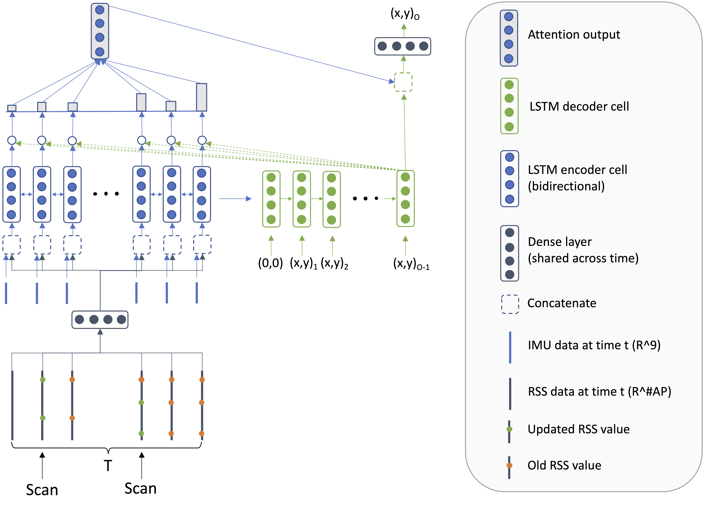

## Interpreting indoor positioning as neural machine translation (NMT) problem

This repository is meant as final project after having attended CS224N (Deep Learning for Natural Language Processing).
Instead of targeting a dedicated NLP problem, the goal of this project is to apply the learned ideas to a different domain – indoor positioning.

Please open the README.ipynb for further details.

### Model architecture

